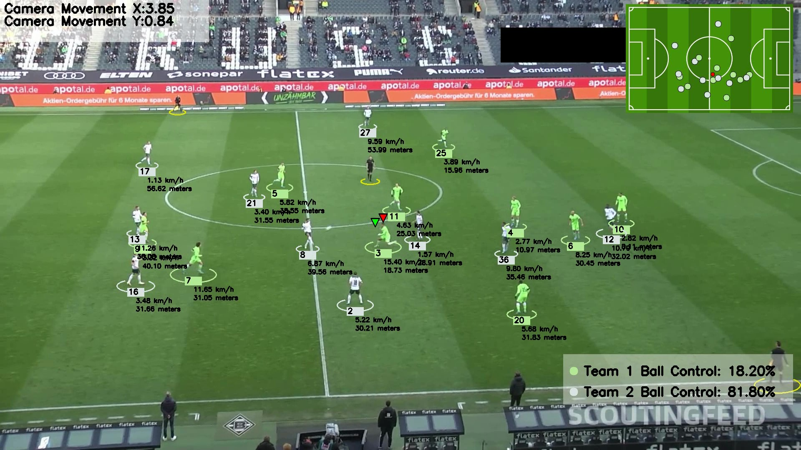

# Football Players and Ball Tracking System

This project involves a system for detecting and tracking players, referees, and the ball in football matches using computer vision techniques and deep learning.

<video controls src="output_videos/example.mp4" title="Title"></video>
## Tools Used

- **YOLO (You Only Look Once)**: Used for object detection, including players, referees, and the ball.
- **Supervisely**: Used for object tracking in video.
- **OpenCV**: Used for image and video processing, as well as for visualization and annotation.
- **Python**: Primary programming language.
- **Pandas, NumPy**: Used for data manipulation and analysis.
- **Matplotlib**: Used for data visualization.
- **Roboflow**: Used for importing and organizing training data.
- **NVIDIA GPU**: Used for training detection and tracking models.

## Models Used

- **YOLOv5**: Used as the base model for detecting players, referees, and the ball. It was trained using data from a custom Roboflow dataset.
- **ByteTrack**: Used for object tracking in video. Provides robust tracking capabilities using specific algorithms.

## Training Process

### YOLOv5 Training

1. **Data Acquisition**: Acquired labeled images and videos of football matches via Roboflow.
2. **Preprocessing**: Preprocessed images for training, ensuring data quality and label accuracy.
3. **Training**: Used YOLOv5 to train a custom object detection model. Hyperparameters were optimized to improve accuracy and performance.
4. **Validation**: Evaluated the trained model on a validation dataset to verify accuracy and generalization capability.

### ByteTrack Training

1. **Environment Setup**: Configured ByteTrack with appropriate parameters for tracking players, referees, and the ball.
2. **Integration with YOLOv5**: Integrated YOLOv5 detection outputs with ByteTrack for continuous tracking in video.
3. **Optimization**: Optimized tracking parameters to improve tracking accuracy and stability in real-time.

## Problem Solving 🛠️

### Problem: Accurate Detection and Tracking

- **Solution**: Implemented a custom YOLOv5 model trained on a specific football dataset, significantly improving object detection accuracy.
- **Result**: The model can detect players, referees, and the ball with high precision under varying lighting and motion conditions.

### Problem: Continuous and Stable Tracking

- **Solution**: Used ByteTrack for continuous video tracking, integrating YOLOv5 detection outputs to provide unique identifiers to tracked objects.
- **Result**: The system can robustly track objects even when they are partially or completely out of frame for several frames.

### Problem: Data Visualization and Annotation

- **Solution**: Developed Python functions using OpenCV to visualize and annotate player, referee, and ball positions in video.
- **Result**: Generated annotated videos with information on ball possession and player/referee positions in each frame.

---

This README provides a clear overview of the project. Be sure to adjust the information based on specific details and results obtained in your project.
